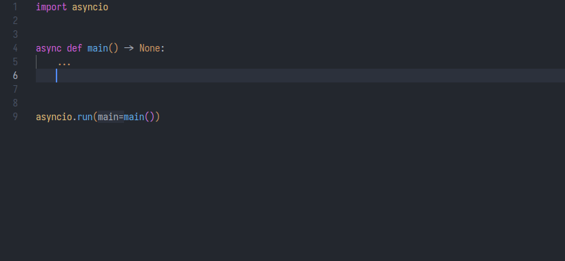
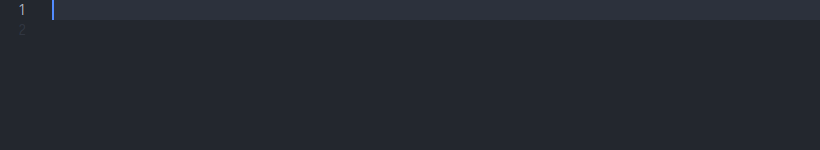

# Charming Completions

This extension provides extra completion support for Python in VSCode.

## Features

### Postfix completions

Allowing to use some postfix to wrap a value. Inspired from other editors.

#### Examples

#### List of supported functions/keywords

- Functions (`foo.xxx => xxx(foo)`)

  - `print`
  - `repr`
  - `id`
  - `hash`
  - `len`
  - `abs`
  - `sum`
  - `round`
  - `str`
  - `int`
  - `float`
  - `bool`
  - `type`
  - `list`
  - `tuple`
  - `reversed`
  - `set`
  - `isinstance`
  - `issubclass`
  - `enumerate`
- Keywords (`foo.xxx => xxx foo`)

  - `assert`
  - `await`
  - `del`
  - `raise`
  - `return`
  - `yield`
- Others

  - `foreach => for i in ...:`
  - `forenum => for i, elem in enumerate(...):`
  - `aforeach => async for i in ...:`
  - `comp => expr for i in ...`
  - `acomp => expr async for i in ...`
  - `def => def func_name(*args, **kwds)`
  - `adef => async def func_name(*args, **kwds)`
  - `for => for i in it`
  - `afor => async for i in it`
  - `with => with context`
  - `awith => async with context`

### Re-export completions

Providing a shortcut for re-exporting.

## Requirements

- VSCode >= 1.74

## Extension Settings

This extension contributes the following settings:

* No settings available.
